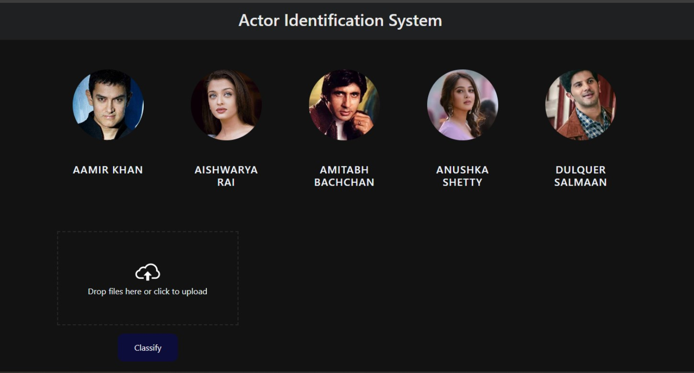
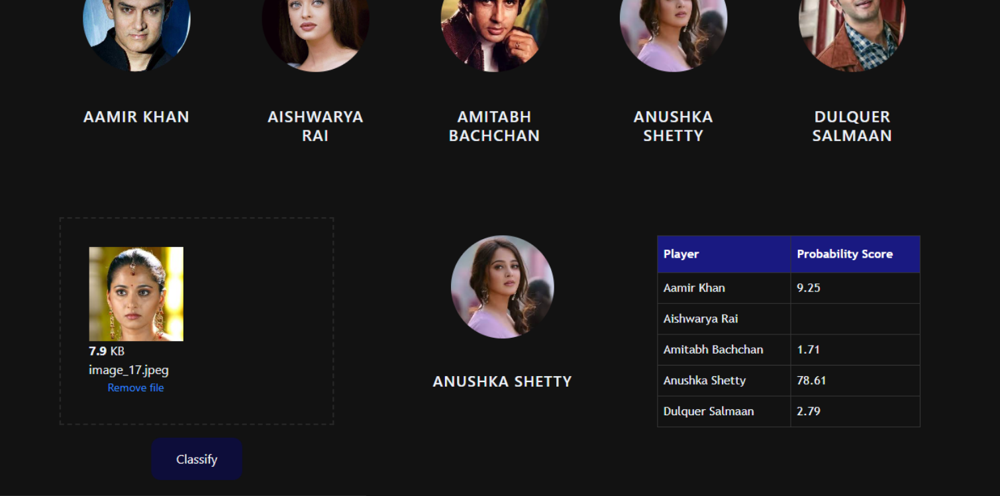

In this data science and machine learning project, we classify Indian movie actors. We restrict classification to only 5 people,
1) Aishwarya Rai
2) Aamir khan
3) Amitabh Bhachchan
4) Anushka Shetty
5) Dulquer Salmaan

Here is the folder structure,
* UI : This contains ui website code 
* server: Python flask server
* model: Contains python notebook for model building
* google_image_scrapping: code to scrap google for images
* images_dataset: Dataset used for our model training

Technologies used in this project,
1. Python
2. Numpy and OpenCV for data cleaning
3. Matplotlib & Seaborn for data visualization
4. Sklearn for model building
5. Jupyter notebook, visual studio code and pycharm as IDE
6. Python flask for http server
7. HTML/CSS/Javascript for UI

